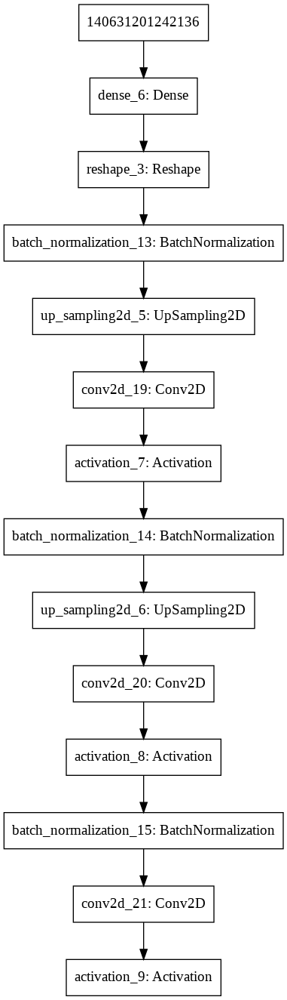
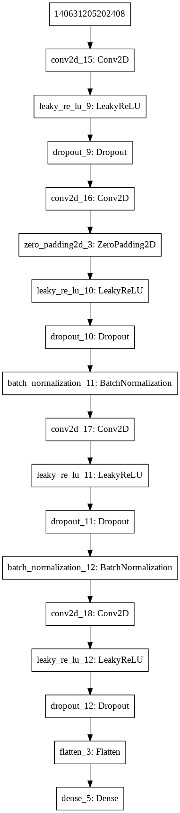
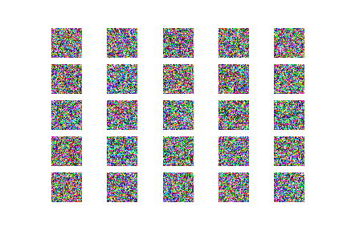
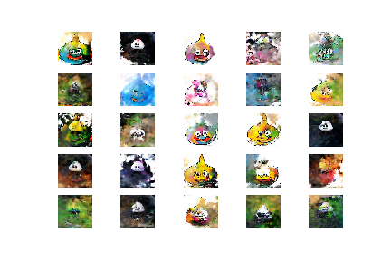

# GANでいろいろ画像を生成してみる
DCGANを使用して自分が生成してみたい画像を生成してみる。
例えば、ドラクエのスライムを学習画像とする など

- [GANでいろいろ画像を生成してみる](#GAN%E3%81%A7%E3%81%84%E3%82%8D%E3%81%84%E3%82%8D%E7%94%BB%E5%83%8F%E3%82%92%E7%94%9F%E6%88%90%E3%81%97%E3%81%A6%E3%81%BF%E3%82%8B)
- [Setup](#Setup)
  - [Ènvironment](#%C3%88nvironment)
- [Usage](#Usage)
  - [Overview](#Overview)
  - [model](#model)
  - [Code](#Code)
  - [Result](#Result)
- [References](#References)

# Setup
## Ènvironment
- Google Colaboratory
  -  runtime：python3 GPU  
  
# Usage
## Overview
1. 生成したい画像を収集(Google image downloador etc)
2. 収集した画像をリサイズ(128×128)
3. githubからcloneしたコードを実行(clone対象References参照。rarなどのdataset解凍は今回は不要。)

## model
- Generator model

- Discriminator model

## Code
https://github.com/HijikiTaro/GEN-IMAGE/blob/master/gen_image.ipynb

## Result

  

# References
https://github.com/taku-buntu/Keras-DCGAN-killmebaby  
